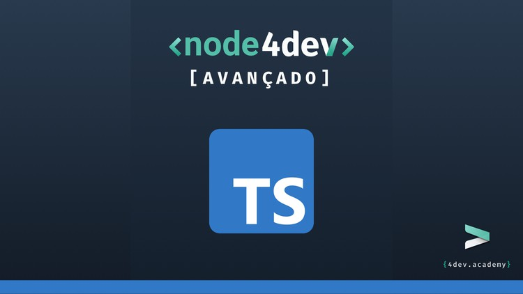

# **Advanced Node**

---

## [**Link para o curso completo**](https://www.udemy.com/course/nodejs-avancado/?referralCode=AF51096F87A7A9A81C5C)

Essa API faz parte do treinamento do professor Rodrigo Manguinho (Mango) na Udemy.

O objetivo do treinamento é mostrar como criar uma API com uma arquitetura bem definida e desacoplada, utilizando TDD (programação orientada a testes) como metodologia de trabalho, Clean Architecture para fazer a distribuição de responsabilidades em camadas, sempre seguindo os princípios do SOLID e, sempre que possível, aplicando Design Patterns para resolver alguns problemas comuns.

> ## Princípios

* Single Responsibility
* Open Closed
* Liskov Substitution
* Interface Segregation
* Dependency Inversion
* Separation of Concerns
* Don't Repeat Yourself
* You Aren't Gonna Need It
* Keep It Simple
* Composition Over Inheritance
* Small Commits

> ## Design Patterns

* Factory
* Adapter
* Composite
* Decorator
* Command
* Dependency Injection
* Abstract Server
* Composition Root
* Builder
* Template Method
* Singleton

> ## Metodologias e Designs

* TDD
* Clean Architecture
* DDD
* GitFlow
* Modular Design
* Dependency Diagrams
* Use Cases
* Spike (Agile)

> ## Bibliotecas e Ferramentas

* NPM
* Typescript
* Git
* Jest
* TypeORM
* Axios
* Postgres
* JsonWebToken
* Express
* Supertest
* Husky
* Lint Staged
* Eslint
* Standard Javascript Style
* Rimraf
* In-Memory Postgres Server
* Module-Alias
* Npm Check

> ## Features do Typescript

* POO Avançado
* Strict Mode
* Interface
* TypeAlias
* Namespace
* Utility Types
* Modularização de Paths
* Configurações
* Build

> ## Features de Testes

* Testes Unitários
* Testes de Integração
* Cobertura de Testes
* Test Doubles
* Mocks
* Stubs
* Spies
* Fakes
